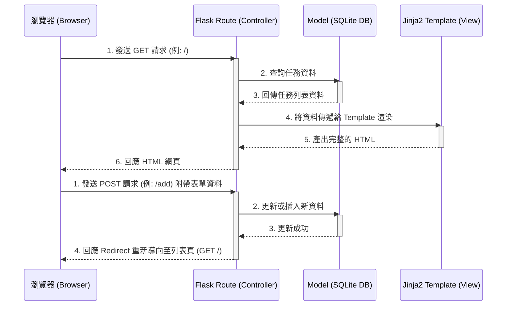

# 系統架構文件 (Architecture Strategy)

## 1. 技術架構說明

本專案採用經典的伺服器端渲染 (Server-Side Rendering) 網站架構，不採用前後端分離，以求快速開發與迭代。

### 選用技術與原因
- **後端框架：Python + Flask**
  - **原因**：Flask 是一個輕量且彈性的微框架，非常適合用來快速開發小型應用程式，學習曲線也相對平緩。
- **模板引擎：Jinja2**
  - **原因**：Flask 內建支援 Jinja2，能方便地將後端資料注入 HTML 網頁中，直接在伺服器端渲染動態畫面。
- **資料庫：SQLite**
  - **原因**：它是檔案型資料庫，不需要額外架設與維護資料庫伺服器，非常適合單人或小團隊開發 MVP (最小可行性產品) 的資料儲存。

### Flask MVC 模式說明
雖然 Flask 本身不強制要求 MVC 架構，但我們在專案中會採用這個概念來組織各部邏輯：
- **Model (模型)**：負責定義資料結構與資料庫的互動邏輯（例如 CRUD 操作資料庫中的任務）。
- **View (視圖)**：負責呈現使用者介面。主要由 Jinja2 模板負責產生 HTML 內容，並結合 CSS/JS 提供外觀。
- **Controller (控制器)**：負責處理使用者的 HTTP 請求、呼叫 Model 取得或更新資料，最後傳遞給 View 進行渲染。在 Flask 中，主要由路由 (Routes) 扮演這個角色。

## 2. 專案資料夾結構

以下為建議的專案目錄組織方式：

```text
web_app_development/
├── app.py                # 應用程式入口（初始化 Flask 與註冊路由）
├── app/                  # 主要應用程式模組目錄
│   ├── models/           # 處理資料庫模型的目錄
│   │   └── task.py       # 定義任務的相關資料庫操作邏輯
│   ├── routes/           # 接待請求的控制器目錄 (Controller)
│   │   └── task_routes.py# 任務的 HTTP 路徑定義 (如 /add, /edit 等)
│   ├── templates/        # Jinja2 HTML 模板目錄 (View)
│   │   ├── base.html     # 頁面的共用骨架 (如 <head> 及導覽列)
│   │   └── index.html    # 顯示任務列表的主頁與表單
│   └── static/           # 靜態資源目錄
│       ├── css/
│       │   └── style.css # 客製化的頁面樣式
│       └── js/
│           └── main.js   # 額外的前端腳本檔（若需要）
├── instance/             # 獨立於版本控制的實體資料夾
│   └── database.db       # SQLite 資料庫檔案
├── docs/                 # 文件存放目錄
│   ├── PRD.md            # 產品需求文件
│   └── ARCHITECTURE.md   # 系統架構文件（本檔案）
└── requirements.txt      # Python 相依套件清單檔
```

## 3. 元件關係圖

以下展示各元件處理請求時的互動流程：



## 4. 關鍵設計決策

1. **模組化路由與模型 (Blueprint 與關注點分離)**
   - 我們選擇將 `routes` 與 `models` 抽出為獨立檔案，而不是全部寫在一個巨大的 `app.py` 內。這能大幅提升可讀性與測試方便性。如果未來有加新的模組（例如帳號系統），可以直接建立新檔案並在 `app.py` 中註冊。
2. **採用 Server-Side Rendering (SSR) 而非 API 架構**
   - 任務管理系統 MVP 強調快速與輕量，比起讓前端等待資料傳輸 (Fetch API) 再組裝畫面，由後端 Jinja2 一次把 HTML 組織好能確保載入速度夠快，同時減少前後端溝通上的複雜問題。
3. **分離資料庫檔案實體**
   - 設定 `instance/` 資料夾用於存放 SQLite 的 `.db` 檔，避免開發測試時產生的髒資料不小心被 commit 到 Git 中。
