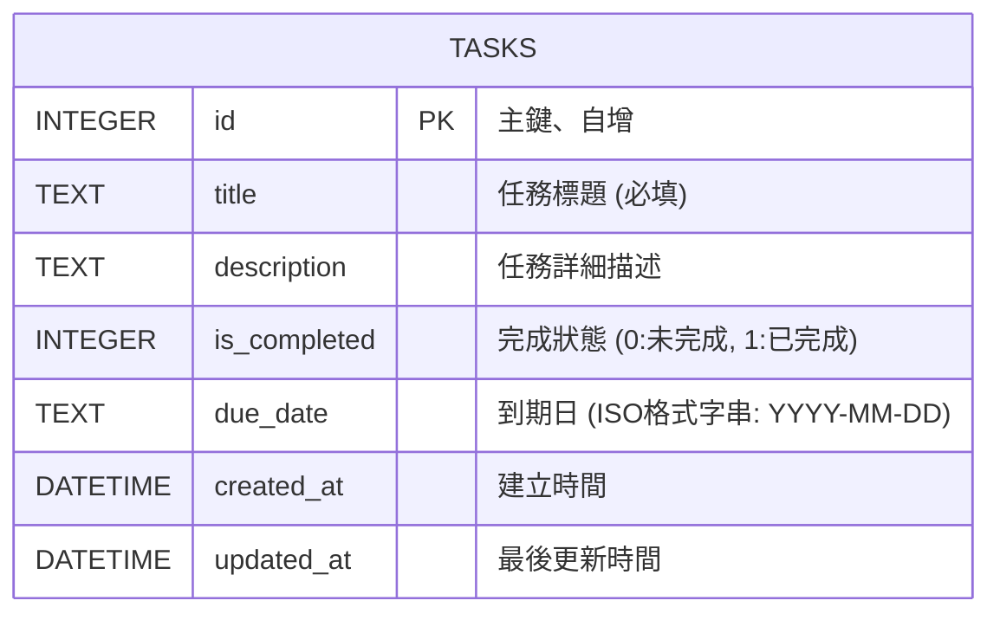

# Database Design 文件 (DB Design)

這份文件記錄了任務管理系統（Task Management System）的資料庫設計，包含實體關聯圖 (ER Diagram) 與各表的欄位設計說明。

## 1. 實體關係圖 (ER Diagram)

我們專注於 MVP 版本，這裡主要有一個資料表來儲存所有的任務 (Task)：

## 2. 資料表詳細說明

### Table: `tasks`
負責儲存使用者的所有待辦事項。

| 欄位名稱 | 資料型別 | 屬性 / 預設值 | 說明 |
| :--- | :--- | :--- | :--- |
| `id` | `INTEGER` | `PRIMARY KEY AUTOINCREMENT` | 任務的唯一識別碼 |
| `title` | `TEXT` | `NOT NULL` | 任務的簡短標題，不可為空 |
| `description`| `TEXT` | | 任務的長篇描述細節 |
| `is_completed`| `INTEGER` | `DEFAULT 0` | 任務狀態。 `0` 表示未完成，`1` 表示已完成。SQLite 不原生支援 boolean，故使用 INTEGER 替代 |
| `due_date` | `TEXT` | | 使用者的期望完成日，以字串格式 `YYYY-MM-DD` 儲存方便排序 |
| `created_at` | `DATETIME` | `DEFAULT CURRENT_TIMESTAMP` | 系統收到的自動建立時間 |
| `updated_at` | `DATETIME` | `DEFAULT CURRENT_TIMESTAMP` | 任務最後一次修改的時間 |

## 3. SQL 建表語法

> 完整的 SQL 儲存於專案根目錄下的 `database/schema.sql` 之中。

採用 SQLite 語法建置，能符合 Python 內建套件呼叫或 SQLite Browser 解析使用。
