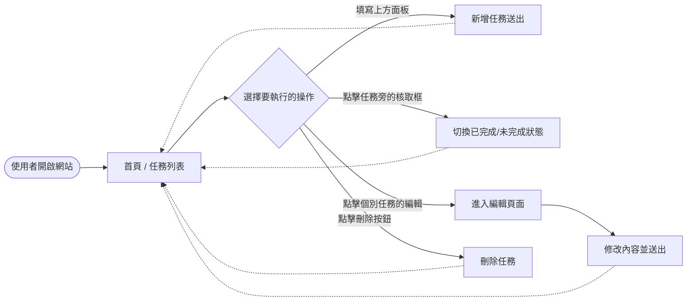
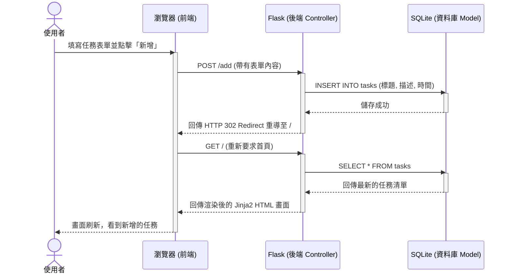

# 流程圖與路由設計 (Flowcharts & Routing)

本文件根據專案的 PRD 與系統架構設計，梳理出使用者的操作流程、系統背後的資料處理序列圖，並建立每個功能對應的 URL 與 HTTP 方法對照表。

## 1. 使用者流程圖 (User Flow)

此圖展示使用者打開網頁後，進行不同管理任務操作的視覺化路徑。

## 2. 系統序列圖 (Sequence Diagram)

這裡以最常見的**「新增任務」**為例，描述從使用者操作到資料庫成功儲存的完整流程：

## 3. 功能清單對照表

根據 PRD 提出的 CRUD 與狀態切換功能，設計出以下的路由（Routes）規劃：

| 功能描述 | 對應 URL 路徑 | HTTP 方法 | 備註說明 |
| --- | --- | --- | --- |
| 顯示全部任務列表 | `/` | GET | 首頁，負責顯示資料庫中的所有任務與新增表單 |
| 處理新增任務請求 | `/add` | POST | 接收表單傳入的欄位，存入資料庫後重導回 `/` |
| 顯示單一任務編輯頁 | `/edit/<int:task_id>` | GET | 負責顯示舊資料與編輯用表單 |
| 更新單一任務資料 | `/edit/<int:task_id>` | POST | 接收修改後的內容，覆寫資料後重導回 `/` |
| 標記任務完成狀態 | `/toggle/<int:task_id>`| POST | 變更該筆任務狀態後重導回 `/` |
| 刪除指定任務 | `/delete/<int:task_id>`| POST | 刪除該筆資料紀錄後重導回 `/` |

> **設計說明**：因為沒有採用前端框架攔截請求，這裡我們採用傳統的 HTML form POST 送出表單資料來做到資料修改、刪除以及狀態的切換。
